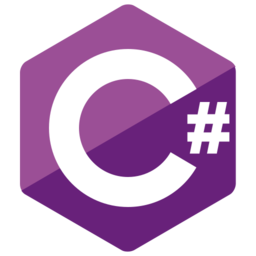
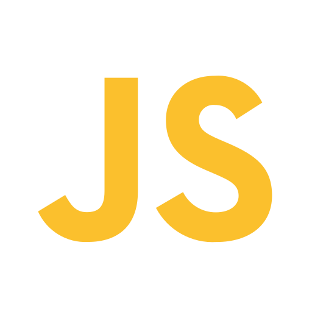
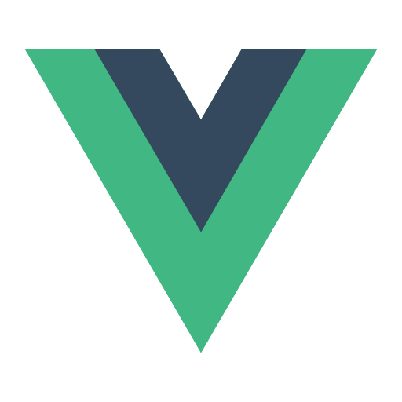
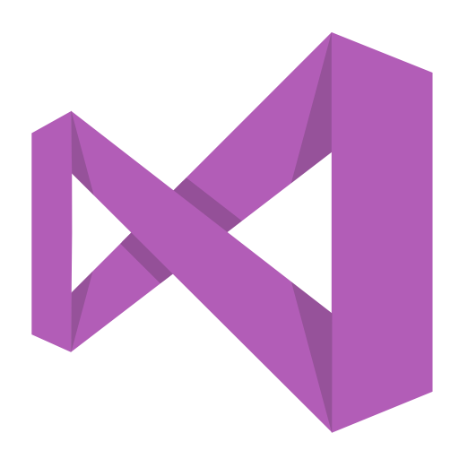
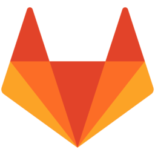
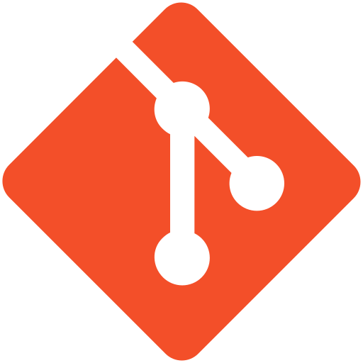
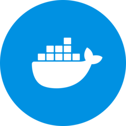

### Hi👋 我是 x2031

  🔭 喜欢代码
  
  🌱 喜欢研究
  
  ⚡ 热爱编程
  
  💬 热心肠
  
**使用的语言和框架**

<code></code>
<code></code>
<code></code>
<code></code>

**工具**

<code></code>
<code></code>
<code></code>
<code></code>
<code></code>
<code></code>
<code></code>
<code></code>
<code></code>
<code></code>
